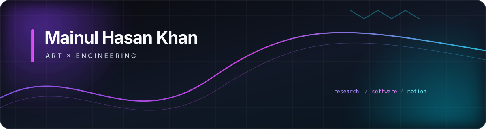

  CSE graduate · Software builder · Deep learning & NLP enthusiast · Motion designer

  I build thoughtful software at the intersection of <strong>engineering, research, and visual creativity</strong>.
  My work spans full-stack applications, machine learning, interactive graphics, and motion design.

## Currently

- Deepening my software engineering, deep learning, and NLP practice
- Building production-minded projects for software engineering and ML/NLP roles
- Exploring creative technology, interactive 3D experiences, and visual storytelling

## Featured work

<table>
<tr>
<td width="50%" valign="top">

### ☁️ [Flappy Clouds](https://github.com/steezy-archv/Flappy-Clouds)

A full-stack storefront for handmade products with authentication, search, cart, checkout, administration, and automated tests.

`ASP.NET Core MVC` `C#` `EF Core` `SQL Server`

</td>
<td width="50%" valign="top">

### 🏡 [Snowbound Cottage](https://github.com/steezy-archv/Cottage-Building---Three.js)

An interactive winter environment with dynamic day-night lighting, custom GLSL shaders, snowfall particles, GLTF assets, and raycast interaction.

`Three.js` `JavaScript` `WebGL` `GLSL`

</td>
</tr>
<tr>
<td width="50%" valign="top">

### 💧 [Water Potability Prediction](https://github.com/steezy-archv/WaterPotabilityPrediction)

A data-mining pipeline for classification, K-Means clustering, association-rule mining, and saved-model inference on water-quality data.

`Java` `WEKA` `Maven` `Machine Learning`

</td>
<td width="50%" valign="top">

### 🎧 [Mixify](https://github.com/steezy-archv/Mixify-Movies-Melody_Flutter-App-)

A cross-platform entertainment app combining local music playback with TMDB-powered movie and TV discovery, search, trailers, and favorites.

`Flutter` `Dart` `TMDB API` `SQLite`

</td>
</tr>
</table>

## Areas of interest

- Deep learning and natural language processing
- Applied machine learning and information retrieval
- Human-centered software and creative technology
- Interactive graphics, motion, and visual communication

## Tools I work with

**Software and data**

**Creative**

<table>
<tr>
<td align="center" width="25%">
   
  <strong>After Effects</strong>
</td>
<td align="center" width="25%">
   
  <strong>Premiere Pro</strong>
</td>
<td align="center" width="25%">
   
  <strong>Illustrator</strong>
</td>
<td align="center" width="25%">
   
  <strong>Blender</strong>
</td>
</tr>
</table>

---

  Based in Dhaka, Bangladesh · Open to software engineering, ML/NLP, creative-development, and research opportunities

